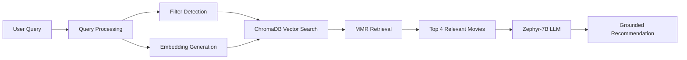

# 🎬 Cine-RAG: Context-Aware Movie Recommendation Engine

    

**Cine-RAG** is an advanced Retrieval-Augmented Generation (RAG) system that revolutionizes movie recommendations by understanding semantic intent rather than relying on simple keyword matching. Unlike traditional recommendation systems that depend on user viewing history, Cine-RAG leverages a **Vector Database** to comprehend natural language queries such as:

- *"Dystopian movies where teenagers fight to the death"*
- *"Action movies released after 2022 with high ratings"*
- *"Psychological thrillers with unreliable narrators"*

---

## 🚀 Key Features

### 🧠 Semantic Understanding
- Utilizes `all-MiniLM-L6-v2` embeddings to capture the "essence" of your request beyond simple keyword matching
- Understands context, themes, and narrative elements in natural language

### 🔍 Hybrid Filtering
- Combines vector similarity search with metadata filtering
- Support for complex queries like: `Year > 2023 AND Genre = Action AND Rating > 7.5`

### ⚡ Privacy-First Local LLM
- Runs **4-bit quantized Zephyr-7B-Beta** locally on Tesla T4 GPU
- No data sent to external APIs
- Completely free and privacy-preserving

### 🛡️ Anti-Hallucination Architecture
- Implements strict "Evidence-Based Reasoning" prompts
- Prevents model from fabricating non-existent movies
- Chain-of-Thought prompting ensures factual accuracy

### 🎯 Smart Retrieval
- Uses **Maximum Marginal Relevance (MMR)** algorithm
- Ensures diverse, non-redundant recommendations
- Balances relevance with variety

---

## 🛠️ Tech Stack

| Component | Technology |
|-----------|-----------|
| **Orchestration** | LangChain |
| **Vector Database** | ChromaDB |
| **LLM** | HuggingFace Zephyr-7B-Beta (4-bit quantized) |
| **Embeddings** | sentence-transformers/all-MiniLM-L6-v2 |
| **Data Processing** | Pandas (1M+ rows → 27K curated entries) |
| **Frontend** | Gradio |
| **Quantization** | bitsandbytes |

---

## ⚙️ How It Works



### Pipeline Breakdown

1. **Data Ingestion**
   - Loads curated dataset of 27,000+ movies with metadata and plot summaries
   - Each movie includes: title, genre, year, rating, plot, and more

2. **Vector Embedding**
   - Text descriptions converted into 384-dimensional vectors
   - Stored in ChromaDB for lightning-fast similarity search

3. **Intelligent Retrieval**
   - Detects temporal filters (e.g., "after 2020")
   - Extracts genre preferences
   - Retrieves top 4 most relevant movies using MMR

4. **Grounded Generation**
   - Retrieved data passed to Zephyr-7B with strict grounding prompt
   - LLM generates recommendations with explicit reasoning
   - Citations to prevent hallucinations

---

## 💻 Installation & Setup

This project is optimized for **Kaggle** (free Tesla T4 GPU) or local machines with NVIDIA GPUs (12GB+ VRAM recommended).

### Prerequisites

- Python 3.10+
- NVIDIA GPU with 12GB+ VRAM (for local deployment)
- CUDA 11.8+ and cuDNN

**OR**

- Run on Kaggle using the `chatbot.ipynb` notebook with included datasets and requirements file

### 1. Clone the Repository

```bash
git clone https://github.com/Mohammed2372/Movies-Recommendation-Chatbot-RAG.git
cd Movies-Recommendation-Chatbot-RAG
```

### 2. Install Dependencies

```bash
pip install -r requirements.txt
```

### 3. Run Chatbot

Run all cells in [chatbot.ipynb](chatbot.ipynb) notebook. A frontend UI is available for interactive testing.

---

## 🧠 Engineering Challenges & Solutions

### Challenge 1: Hallucination Control
**Problem:** The 7B model would fabricate details, claiming a 2023 movie was released in 2021 or inventing non-existent films.

**Solution:** Implemented Chain-of-Thought (CoT) prompting that forces the model to explicitly state evidence before making claims.

---

### Challenge 2: Dataset Quality
**Problem:** Raw TMDB dataset contained 1M+ entries, including unreleased clips, duplicate entries, and low-quality productions.

**Solution:** Engineered robust Pandas pipeline with filters (`vote_count > 50`, `status == 'Released'`, deduplication) resulting in 27,000 high-quality movies.

---

### Challenge 3: Retrieval Diversity
**Problem:** Vector search would return very similar movies (e.g., all Marvel films for "superhero" query).

**Solution:** Implemented Maximum Marginal Relevance (MMR) to balance relevance with diversity across different sub-genres.

---

## 🎯 Usage Examples

### Example 1: Thematic Query
```
User: "Movies about artificial intelligence gaining consciousness"

Response:
Based on your query, here are recommendations:

1. **Ex Machina** (2014) - Drama/Sci-Fi
   A programmer is selected to evaluate the human qualities of a breathtaking AI.
   
2. **Her** (2013) - Romance/Sci-Fi
   A lonely writer develops an unlikely relationship with an operating system...
```

### Example 2: Filtered Query
```
User: "Action movies from 2023 with ratings above 8"

Response:
Here are high-rated action films from 2023:

1. **John Wick: Chapter 4** (2023) - Action/Thriller [8.2/10]
   John Wick uncovers a path to defeating The High Table...
```

---


## 🙏 Acknowledgments

- **TMDB** for the movie dataset
- **Hugging Face** for Zephyr-7B and transformers library
- **LangChain** team for the RAG framework
- **ChromaDB** for the vector database
- **Kaggle** for free GPU resources and datasets
- **Datasets**
   - [tmdb-movie-metadata](https://www.kaggle.com/datasets/tmdb/tmdb-movie-metadata)
   - [tmdb-movies-dataset-2023-930k-movies](https://www.kaggle.com/datasets/asaniczka/tmdb-movies-dataset-2023-930k-movies)

---
